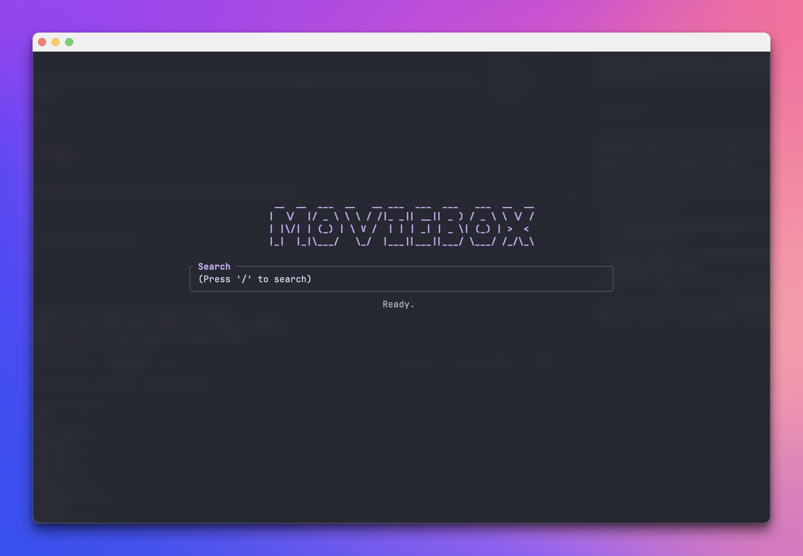
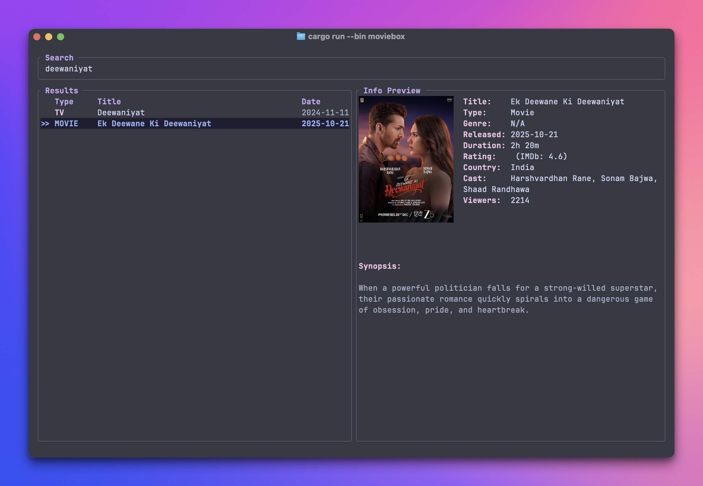
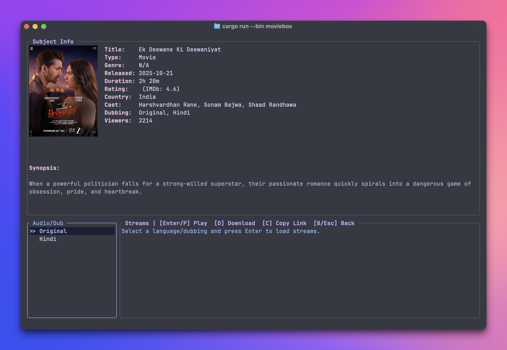
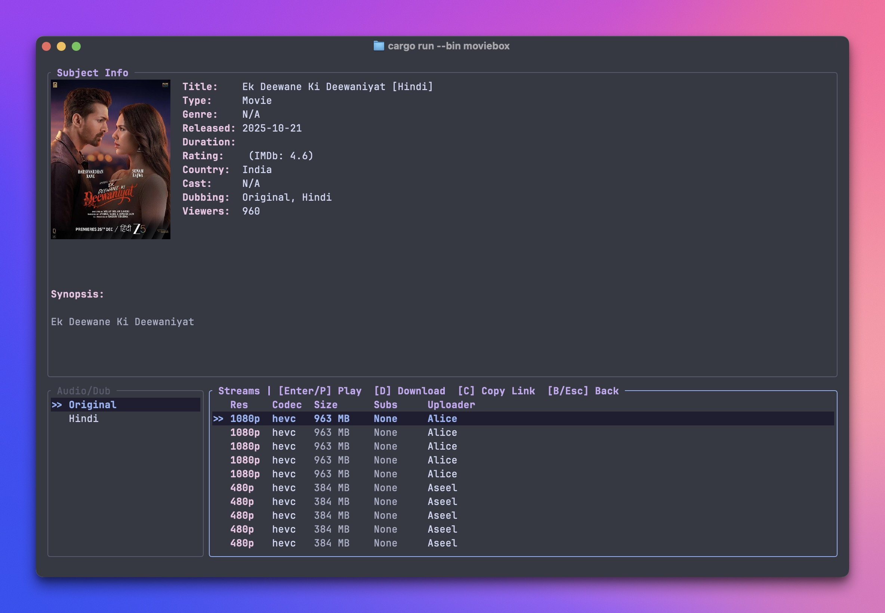
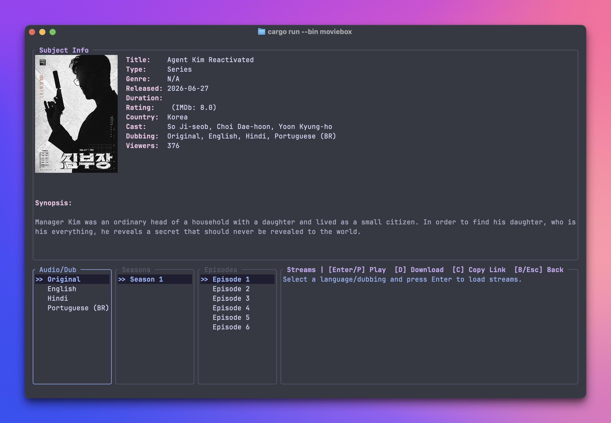

# MovieBox-Tui

A lightning fast, zero-config terminal user interface (TUI) for streaming movies and TV series directly from your terminal.

## Installation

```sh
cargo install moviebox-tui
```

*Note: Requires `mpv` installed on your system for video playback.*

## Usage

Launch the app from your terminal:

```sh
moviebox-tui
```

- **Search**: Press `/` to search for movies or shows.
- **Play**: Select a result and press `Enter` to stream instantly.
- **Logs**: Press `Ctrl+L` to view internal network logs.
- **Quit**: Press `q` or `Esc` to exit.

## Features

- Instant streaming with `mpv`
- Full metadata (seasons, episodes, dubs, and subs)
- Built in geo-unblocking (zero VPN required)
- Copy direct stream URLs to clipboard

## Screenshots

<details>
<summary>Click to view screenshots</summary>

<br>

### Home Screen


### Search Results


### Movie Details


### Stream Selection


### TV Series Details


</details>

## License

Dual-licensed under MIT or Apache-2.0.
